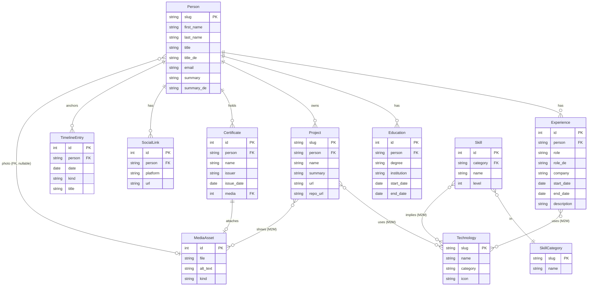

# Entity-Relationship Diagram

The CV domain has one root entity (`Person`) with several owned collections and two pure lookup tables (`Technology`, `SkillCategory`).

## Conventions

| Convention | Rule | Reason |
|---|---|---|
| Foreign keys | `on_delete=PROTECT` | Prevent accidental cascading wipes; an admin must explicitly clear children before deleting a parent. |
| Mixin | `Orderable` ABC supplies `order`, `is_published`, `created_at`, `updated_at`; `Meta.ordering = ["order", "id"]` | One place to change publication and ordering semantics. |
| Bilingual fields | `field` (EN, canonical) + `field_de` (DE, optional) | Avoids the migration friction of `django-modeltranslation`; frontend picks via `pickLocalized()`. |
| Indexed lookups | `slug` columns indexed + unique on `Person`, `Project`, `Technology`, `SkillCategory` | URL-friendly identifiers stable across migrations. |
| Date ordering | `Experience.Meta.ordering = ["-start_date", "order"]` (newest first) | Most recent role surfaces top of the CV. |

## Why the `Person` root

This is a single-person CV. The data model is deliberately Person-rooted rather than multi-tenant: every owned collection has a FK to `Person`. The single-row constraint is enforced by convention (the seed command creates exactly one) rather than by schema — leaves the door open for multi-CV instances later.

## Migration churn warning

The `Orderable` mixin + bilingual field pattern means every schema migration touches many rows. Migrations are designed to be additive: prefer adding nullable columns over reshaping existing ones. The current migrations directory contains exactly one initial migration per app (`0001_initial.py`).
